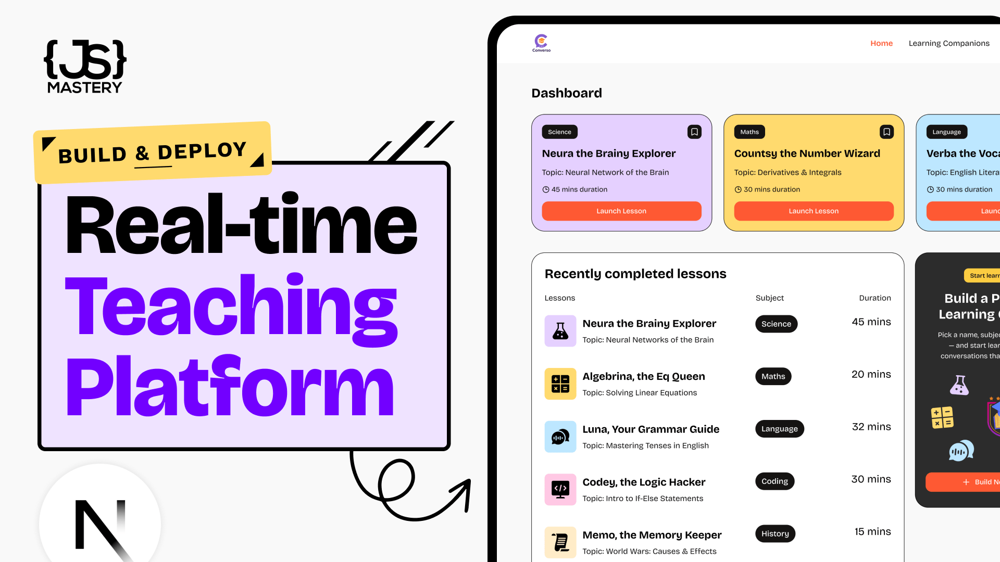

# Converso - Real-time AI Teaching Platform

Converso is a cutting-edge AI teaching platform that provides real-time, interactive learning experiences through voice conversations with AI companions.

## Features

- **Personalized Learning:** Build and customize AI companions with specific names, subjects, voices, and personalities.
- **Real-time Voice Conversations:** Engage in natural and fun voice conversations with AI tutors.
- **Subject-Specific Companions:** Access companions across various subjects like Maths, Language, Science, History, Coding, and Economics.
- **Session Tracking:** Keep track of your learning journey with recent sessions and bookmarked companions.
- **Subscription Plans:** Upgrade your plan to unlock more companions and premium features.

## Getting Started

To get started with Converso, you can explore the companion library, build your own personalized companion, and launch interactive voice lessons.

### Companion Library

Browse through a diverse collection of AI companions, filter them by subject and topic, and bookmark your favorites.

### Build Your Own Companion

Create a new companion by defining its name, subject, topic, voice, style, and estimated session duration.

### Interactive Sessions

Launch a lesson with your chosen companion and engage in real-time voice conversations. The AI tutor will guide you through the topic, breaking it down into smaller parts and ensuring you understand the concepts.

## Screenshots

### Hero Image

### Thumbnail Image

